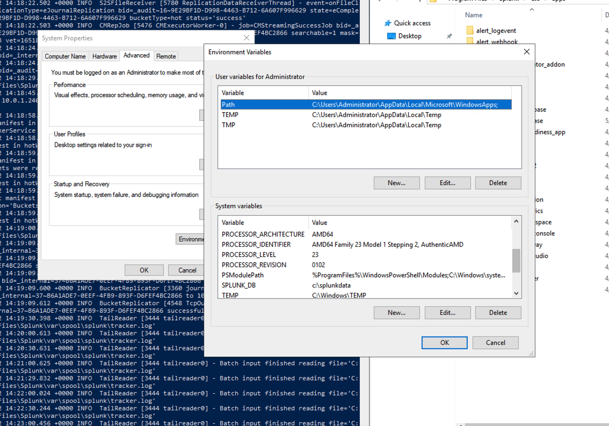

<div id="top"></div>
<!--
*** Thanks for checking out the Best-README-Template. If you have a suggestion
*** that would make this better, please fork the repo and create a pull request
*** or simply open an issue with the tag "enhancement".
*** Don't forget to give the project a star!
*** Thanks again! Now go create something AMAZING! :D
-->


<!-- PROJECT SHIELDS -->
<!--
*** I'm using markdown "reference style" links for readability.
*** Reference links are enclosed in brackets [ ] instead of parentheses ( ).
*** See the bottom of this document for the declaration of the reference variables
*** for contributors-url, forks-url, etc. This is an optional, concise syntax you may use.
*** https://www.markdownguide.org/basic-syntax/#reference-style-links
-->


<!-- PROJECT LOGO -->
<br />
<div align="center">
  <a href="https://github.com/jcspigler2010/windows_to_linux_cluster_conversion">
    
  </a>

<h3 align="center">windows_to_linux_cluster_conversion</h3>

  <p align="center">
    project_description
    <br />
    <a href="https://github.com/jcspigler2010/windows_to_linux_cluster_conversion"><strong>Explore the docs »</strong></a>
    <br />
    <br />
  </p>
</div>


<!-- TABLE OF CONTENTS -->
<details>
  <summary>Table of Contents</summary>
  <ol>
    <li>
      <a href="#about-the-project">About The Project</a>
      <ul>
        <li><a href="#warning">WARNING!!</a></li>
      </ul>
      <ul>
        <li><a href="#conf_used">.conf files used</a></li>
      </ul>
    </li>
    <li>
      <a href="#getting-started">Getting Started</a>
      <ul>
        <li><a href="#prerequisites">Prerequisites</a></li>
        <li><a href="#installation">Installation</a></li>
      </ul>
    </li>
    <li><a href="#usage">Usage</a></li>
    <li><a href="#roadmap">Roadmap</a></li>
    <li><a href="#contributing">Contributing</a></li>
    <li><a href="#license">License</a></li>
    <li><a href="#contact">Contact</a></li>
    <li><a href="#acknowledgments">Acknowledgments</a></li>
  </ol>
</details>


<!-- ABOUT THE PROJECT -->
## About The Project

[![Product Name Screen Shot][product-screenshot]](https://example.com)

Here's a blank template to get started: To avoid retyping too much info. Do a search and replace with your text editor for the following: `github_username`, `repo_name`, `twitter_handle`, `linkedin_username`, `email_client`, `email`, `project_title`, `project_description`

<p align="right">(<a href="#top">back to top</a>)</p>

### WARNING!!
This is not an official Splunk supported migration method, strategy or approach to move from Windows Indexers to Linux Indexers.  
- This is completely unsupported and borderline experimental.

- Without a full comprehensive understanding of how  splunk indexer clustering and multisite clustering works along with architecting and administering a distributed splunk environment, unexpected behavior, outages and worse case scenario irreversible data loss is possible.  

- PLEASE PLEASE PLEASE... if there this is a mission critical system, please back up your indexer data just incase.

- Please if possible test before launching in production.

 Please communicate with stakeholders the previous points and risks.

## .conf files used

* [server.conf](https://docs.splunk.com/Documentation/Splunk/8.2.6/Admin/Serverconf)
* [outputs.conf](https://docs.splunk.com/Documentation/Splunk/8.2.6/Admin/Outputsconf)


<p align="right">(<a href="#top">back to top</a>)</p>


<!-- GETTING STARTED -->
## Getting Started

This is an example of how you may give instructions on setting up your project locally.
To get a local copy up and running follow these simple example steps.

### Prep Windows and Linux servers

You will need to update or set the environment variable SPLUNK_DB in you windows indexers and future linux indexers so your indexes.conf app which is pushed from the cluster manager is homogeneous across the cluster even though directory paths are referenced differently with each OS.

### Linux Servers SPLUNK_DB
This will be done in splunk-launch.conf for linux systems.
* splunk-launch.conf
```#   Version 8.2.5

# Modify the following line to suit the location of your Splunk install.
# If unset, Splunk will use the parent of the directory containing the splunk
# CLI executable.
#
SPLUNK_HOME=/opt/splunk

# By default, Splunk stores its indexes under SPLUNK_HOME in the
# var/lib/splunk subdirectory.  This can be overridden
# here:
#
SPLUNK_DB=/splunkdata
# Splunkd daemon name
SPLUNK_SERVER_NAME=Splunkd

# If SPLUNK_OS_USER is set, then Splunk service will only start
# if the 'splunk [re]start [splunkd]' command is invoked by a user who
# is, or can effectively become via setuid(2), $SPLUNK_OS_USER.
# (This setting can be specified as username or as UID.)
#
# SPLUNK_OS_USER
SPLUNK_OS_USER=splunk
```

###Windows Local Configurations


</a>


###Restart Splunk
`$SPLUNK_HOME/bin/splunk restart`


##Multisite clustering configuration
All of the following steps under this section should be done back to back without restarting splunk.  Restarting splunk on any of the servers *(idxrs shs cm)* could result in an outage.  Pelase wait until the end to restart splunk on all servers.

###Cluster Manager Configuration
<p align="left">
  Apps
  <br />
  <a href="https://github.com/jcspigler2010/windows_to_linux_cluster_conversion/tree/master/apps/org_multisite_master_base"><strong>org_multisite_master_base»</strong></a>
  <br />
    <a href="https://github.com/jcspigler2010/windows_to_linux_cluster_conversion/tree/master/apps/org_cluster_master_indexerDiscovery_server/local"><strong>org_cluster_master_indexerDiscovery_server</strong></a>
  <br />
    <a href="https://github.com/jcspigler2010/windows_to_linux_cluster_conversion/tree/master/apps/org_all_cluster_manager_summary_replication/local"><strong>org_all_cluster_manager_summary_replication</strong></a>
    <br />
    <a href="https://github.com/jcspigler2010/windows_to_linux_cluster_conversion/tree/master/apps/org_all_cluster_managers_assign_primaries_all_sites"><strong>org_all_cluster_managers_assign_primaries_all_sites</strong></a>
</p>

####org_all_cluster_manager_summary_replication
Place org_all_cluster_manager_summary_replication app in the cluster manager's etc/app directory.  Update values to reflect your enviornment

server.conf
```
[clustering]

summary_replication = true
* Valid for both 'mode=manager' and 'mode=peer'.
* Cluster Manager:
  If set to true, summary replication is enabled.
  If set to false, summary replication is disabled, but can be enabled
  at runtime.
  If set to disabled, summary replication is disabled. Summary replication
  cannot be enabled at runtime.
* Peers:
  If set to true or false, there is no effect. The indexer follows
  whatever setting is on the Cluster Manager.
  If set to disabled, summary replication is disabled. The indexer does
  no scanning of summaries (increased performance during peers joing
  the cluster for large clusters).
* Default: false (for both Cluster Manager and Peers)
```

####org_multisite_master_base»
Place org_multisite_master_base» app in the cluster manager's etc/app directory.  Update values to reflect your enviornment

server.conf
```
[general]
site = site1

[clustering]
mode = master
constrain_singlesite_buckets = false
multisite = true
available_sites = site1, site2
cluster_label = awsgov_cluster1
site_replication_factor = origin:2, site2:2, total:4
site_search_factor = origin:2, site2:2, total:4

```
####org_all_cluster_managers_assign_primaries_all_sites>>
Place org_all_cluster_managers_assign_primaries_all_sites>> app in the cluster manager's etc/app directory.  


server.conf
```
[clustering]
assign_primaries_to_all_sites=true
```
*OPTIONAL*

####org_cluster_master_indexerDiscovery_server>>
Place org_cluster_master_indexerDiscovery_server>> app in the cluster manager's etc/app directory.  This is optional if you want to use indexer discovery to guide data forwarding

server.conf
```
[indexer_discovery]
pass4SymmKey = clearshark123!
# * Security key shared between master node and forwarders.
# * If specified here, the same value must also be specified on all forwarders
#  connecting to this master.
# * Unencrypted passwords must not begin with "$1$", as this is used by
#  Splunk software to determine if the password is already encrypted.

# polling_rate = <integer>
# * A value between 1 to 10. This value affects the forwarder polling
#  frequency to achieve the desired polling rate. The number of connected
#  forwarders is also taken into consideration.
# * The formula used to determine effective polling interval,
#  in Milliseconds, is:
#  (number_of_forwarders/polling_rate + 30 seconds) * 1000
# * Default: 10

# indexerWeightByDiskCapacity = <boolean>
# * If set to true, it instructs the forwarders to use weighted load
#  balancing. In weighted load balancing, load balancing is based on the
#  total disk capacity  of the target indexers, with the forwarder streaming
#  more data to indexers with larger disks.
# * The traffic sent to each indexer is based on the ratio of:
#   indexer_disk_capacity/total_disk_capacity_of_indexers_combined
# * Default: false
```


##############################
Site 1 Windows Indexers#######
###############################
server.conf ###Single site configuration all sites
[clustering]

mode = slave
manager_uri = https://10.0.1.240:8089
pass4SymmKey = $7$uQsenT0kCyXxb5S2Yb/YwEvkqJap4dnCnuHgMYTcNypZBfEz65zXwKcmwz3yag==


[replication_port://8080]
disabled = false


server.conf ###multisite configuration
[general]

site = site1

[clustering]
multisite = true


############################
Site 2 Linux Indexers#######
############################

server.conf ###single site all sites
[clustering]
mode = slave
manager_uri = https://10.0.1.240:8089
pass4SymmKey = $7$u3kOfQCemNmrZwcL5wA07Ld9QtlpZAHoybv9TA4D57ULkGdk+4cCYV5xQDCYKg==


[replication_port://8080]
disabled = false

server.conf ###multi site

[general]
site = site2

[clustering]
multisite = true

################
Search Heads#######
#################

outputs.conf ### all sites

[tcpout]
defaultGroup = indexcluster1
maxQueueSize = 7MB
useACK = true

 forceTimebasedAutoLB = true

[tcpout:indexcluster1]


indexerDiscovery = clustermaster1

[indexer_discovery:clustermaster1]

pass4SymmKey = clearshark123!


manager_uri = https://10.0.1.240:8089

server.conf ### all sites

[indexer_discovery]
pass4SymmKey = clearshark123!


server.conf ### all sites

[clustering]
mode = searchhead
manager_uri = clustermanager:one

[clustermanager:one]
manager_uri=https://10.0.1.240:8089
pass4SymmKey = clearshark123!


server.conf ### multisite configuration

server.conf #### multisite configuration

[clustermanager:one]
multisite = true
site = site1

################
Forwarders#######
#################
outputs.conf ### multisite configuration

[tcpout]
defaultGroup = indexcluster1

maxQueueSize = 7MB
useACK = true

forceTimebasedAutoLB = true

[tcpout:indexcluster1]


indexerDiscovery = clustermanager1

[indexer_discovery:clustermanager1]

pass4SymmKey = clearshark123!


master_uri = https://10.0.1.240:8089


server.conf ### multisite configuration

[general]
site = site1


Commands

/opt/splunk/bin/splunk offline
/opt/splunk/bin/splunk fsck scan --all-buckets-all-indexes
/opt/splunk/bin/splunk fsck repair --all-buckets-all-indexes
/opt/splunk/bin/splunk fsck scan --include-rawdata --all-buckets-all-indexes

Change Search head affinity to site 2


server.conf #### multisite configuration

[clustermanager:one]
multisite = true
site = site2

You may need to doing another iteration of fsck repair --all-buckets-all-indexes

server.conf ####

#####Cluster Manager #####
###########################

[general]
site = site2

[clustering]
mode = master
constrain_singlesite_buckets = false
multisite = true
available_sites = site2
cluster_label = awsgov_cluster1
site_replication_factor = origin:2, total:2
site_search_factor = origin:2, total:2

site_mappings = site1:site2

restart cluster manager

stop splunk on windows indexers

fsck any remaining corrupted buckets

https://community.splunk.com/t5/Deployment-Architecture/Question-How-does-Cluster-Master-decide-Primary-searchable-copy/m-p/311222

In non muli-site clustering, its either 0x0, or 0xFFFFFFFF , basically primary or not primary.

The individual bits are only relevant in multi-site clustering.
The flags is a 64 bit bitmask, with the smallest bit corresponding to Primary for site0. The second smallest would be primary for site1, the third for site2, and so on....so 0x0 = primary for nothing (searches from any site will not get results for this bucket on this peer)

Bucket marked 0x1 = searches that come from searchheads with site=0 will get results! (primary for site0)
Bucket marked 0x2 = primary for site1, all site=site1 searches will get results from these buckets
Bucket marked 0x3 == (0x1+0x2) primary for site0 + site1, so searches from site0 SearchHeads and site1 searchheads will get results for this bucket.

On the cluster/master/buckets/BID endpoint, the masks should add up to whatever the mutl-site config is
for example, if We have available_sites=site2,site3, then the mask will need to have 0x1 (site0), 0x4(site2), 0x8 (site3) distributed among its indexers. in this example, if search_factor=1, then only 1 bucket will be searchable and should get assigned all the flags (0x13)
